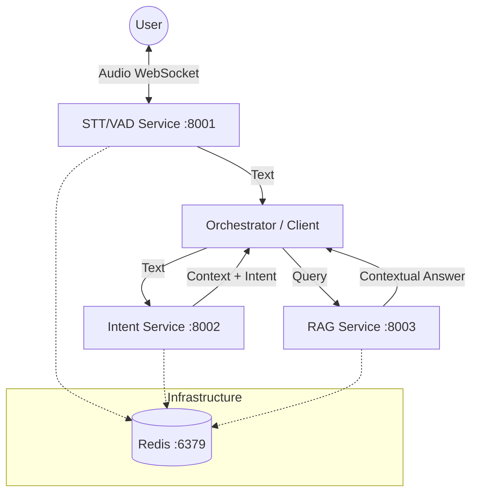

# Leibniz Agent Microservices Integration Guide

This document provides a detailed guide on the architecture, integration, and setup of the Leibniz Agent microservices (STT/VAD, Intent Classification, RAG) using Docker Compose.

## 🏗️ Architecture Overview

The system is decomposed into specialized microservices that communicate via HTTP/WebSocket and share state via Redis.



### Service Responsibilities

| Service | Port | Description | Key Technologies |
|---------|------|-------------|------------------|
| **STT/VAD** | `8001` (API)<br>`7860` (UI) | Real-time Speech-to-Text and Voice Activity Detection. Provides a FastRTC/Gradio UI for browser interaction. | Gemini Live API, FastRTC, Silero VAD |
| **Intent** | `8002` | Three-layer intent classification:<br>1. **Regex (L1)**: Fast pattern matching (<5ms)<br>2. **SLM (L2)**: DistilBERT semantic matching (~50ms)<br>3. **LLM (L3)**: Gemini fallback for complex queries | Spacy, Transformers (DistilBERT), Gemini 2.5 |
| **RAG** | `8003` | Retrieval-Augmented Generation. Indexes knowledge base and answers queries using semantic search. | FAISS, Sentence-Transformers, Gemini 2.0 |
| **Redis** | `6379` | Shared state management, caching, and potentially message brokering. | Redis 7 |

---

## 🚀 Prerequisites

1.  **Docker & Docker Compose**: Ensure Docker Desktop or Docker Engine is installed and running.
2.  **Gemini API Key**: A valid Google Gemini API key.
3.  **Knowledge Base**: Content in `leibniz_knowledge_base/` for the RAG service (automatically indexed during build).
4.  **DistilBERT Model**: Pre-trained model in `leibniz_distilbert_intent_v2/` for the Intent service.

---

## 🛠️ Setup and Build

We provide a helper script to build all services with the correct context.

### 1. Build Services

Run the build script from the project root:

```bash
./services/build_docker_services.sh
```

This script performs the following:
*   Builds `leibniz-stt-vad:latest`
*   Builds `leibniz-intent:latest` (including the local DistilBERT model)
*   Builds `leibniz-rag:latest` (including pre-building the FAISS index)

### 2. Configuration

The services are configured via `services/docker-compose.yml`. Key environment variables:

*   `GEMINI_API_KEY`: **Required**. Set this in your shell or `.env` file.
*   `REDIS_URL` / `LEIBNIZ_REDIS_HOST`: Points to the `redis` service within the Docker network.

---

## ▶️ Running the Stack

To start all services in detached mode:

```bash
# Export your API key first
export GEMINI_API_KEY="your_api_key_here"

# Start via Docker Compose
cd services
docker-compose up -d
```

To view logs:
```bash
docker-compose logs -f
```

To view logs for a specific service (e.g., Intent):
```bash
docker-compose logs -f intent-service
```

---

## 🧪 Verification & Testing

### 1. STT/VAD Service
*   **Health Check**: `curl http://localhost:8001/health`
*   **Browser UI**: Open `http://localhost:7860` (or the generated HTTPS link in logs).
*   **Direct Client**: Open `http://localhost:8001/client` for a raw WebSocket test client.

### 2. Intent Service
*   **Health Check**: `curl http://localhost:8002/health`
*   **Test Classification (L1 - Regex)**:
    ```bash
    curl -X POST http://localhost:8002/api/v1/classify \
      -H "Content-Type: application/json" \
      -d '{"text": "I want to schedule an appointment"}'
    ```
*   **Test Classification (L2/L3 - Semantic)**:
    ```bash
    curl -X POST http://localhost:8002/api/v1/classify \
      -H "Content-Type: application/json" \
      -d '{"text": "My friend is good, but he is not good with directions. Where is the library?"}'
    ```

### 3. RAG Service
*   **Health Check**: `curl http://localhost:8003/health`
*   **Test Query**:
    ```bash
    curl -X POST http://localhost:8003/api/v1/query \
      -H "Content-Type: application/json" \
      -d '{"query": "What are the admission requirements?"}'
    ```

---

## 🧩 Integration Details

### Service-to-Service Communication
*   Services communicate over the `leibniz-network` bridge network.
*   Service names (`redis`, `intent-service`, etc.) are resolvable DNS names within the network.

### Shared Resources
*   **Redis**: Used by Intent service for caching classification results and by RAG/STT for session state.
*   **Models**:
    *   **Intent**: Bakes the `leibniz_distilbert_intent_v2` model directly into the image.
    *   **RAG**: Bakes the FAISS index (`index/`) directly into the image during the build process for faster startup.

### Troubleshooting
*   **"Connection refused"**: Ensure the `redis` container is healthy (`docker ps`).
*   **"Model not found"**: Re-run the build script to ensure local models are copied into the images.
*   **Permissions**: If you get Docker permission errors, ensure your user is in the `docker` group or use `sudo`.


