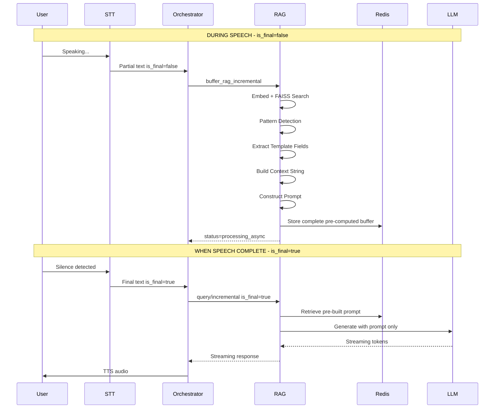

# RAG Optimization Analysis: Pre-LLM Accumulation Strategy

## Executive Summary

This document analyzes the current RAG and Orchestrator architecture to identify optimization opportunities for implementing the **Pre-LLM Accumulation** strategy. The goal is to reduce end-to-end latency by performing all pre-LLM processing (pattern detection, document retrieval, information extraction, prompt construction) incrementally during user speech, so that when speech completes (`is_final=true`), only the LLM generation step remains.

**Target Latency Improvement:**
- Current: Full RAG pipeline (300-800ms+ for LLM generation + retrieval)
- Optimized: Only LLM call (~200-400ms) when speech completes

---

## Current Architecture Analysis

### 1. RAG Service Flow (`rag/app.py` + `rag/rag_engine.py`)

#### Current Endpoints

| Endpoint | Purpose | Processing Mode |
|----------|---------|-----------------|
| `/api/v1/query` | Synchronous RAG query | Full pipeline, blocking |
| `/api/v1/stream_query` | Streaming RAG query | Full pipeline with streaming output |
| `/api/v1/query/incremental` | Incremental processing | Buffered retrieval + generation |

#### Current Processing Pipeline (Standard RAG)

```
User Query → Embedding (40-80ms) → FAISS Search (10-30ms) → Prompt Construction (5-10ms) → LLM Generation (300-600ms)
```

**Total typical latency: 355-720ms**

#### Current Incremental Processing (`/api/v1/query/incremental`)

The system already has partial incremental support:

```python
# From app.py lines 899-1031
@app.post("/api/v1/query/incremental")
async def incremental_query(request: IncrementalQueryRequest):
    """
    TRUE PARALLEL Incremental RAG query with smart Redis buffering.
    
    Workflow:
    - is_final=False: Parallel document retrieval and smart buffering (no blocking)
    - is_final=True: Generate response using all buffered context
    """
```

**Current `is_final=False` Processing:**
1. Fire-and-forget background task (`process_chunk_parallel`)
2. Async embedding and FAISS search
3. Smart document buffering with deduplication
4. Returns immediately with `status="processing_async"`

**Current `is_final=True` Processing:**
1. Retrieves buffered documents from Redis
2. Builds Telugu-aware context string
3. Runs **FULL LLM generation** with streaming

### 2. Orchestrator State Management (`orchestrator/state_manager.py`)

#### FSM States

```python
class State(Enum):
    IDLE = "idle"          # Waiting for session start
    LISTENING = "listening" # Receiving STT fragments
    THINKING = "thinking"   # Processing user input (Intent + RAG)
    SPEAKING = "speaking"   # TTS output in progress
    INTERRUPT = "interrupt" # Barge-in detected
```

#### State Transition Flow

```
IDLE → (intro_start) → SPEAKING → (intro_complete) → LISTENING
LISTENING → (stt_received) → THINKING → (streaming_started) → SPEAKING → (tts_complete) → LISTENING
```

### 3. Orchestrator RAG Integration (`orchestrator/app.py` + `orchestrator/parallel_pipeline.py`)

#### Current STT Event Handling (lines 890-964)

```python
# From app.py - listen_to_redis_events()
if is_final:
    await handle_stt_event(ws_session_id, text, websocket, state_mgr)
else:
    # INCREMENTAL BUFFERING: Pre-fetch documents on partial STT
    if config.tara_mode and config.rag_service_url:
        asyncio.create_task(buffer_rag_incremental(...))
```

**Key Observation:** The orchestrator already triggers incremental buffering on partial STT events!

#### Current handle_stt_event (lines 1122-1195)

```python
async def handle_stt_event(session_id: str, text: str, ...):
    # TARA MODE: Direct RAG call (skip Intent)
    if config.skip_intent_service or config.tara_mode:
        generator = process_rag_incremental(
            user_text=text,
            session_id=session_id,
            rag_url=config.rag_service_url,
            is_final=True,  # This triggers generation
            ...
        )
```

---

## Current Latency Points Analysis

### Timeline for a Typical Query (is_final=true)

```
┌─────────────────────────────────────────────────────────────────────────┐
│                    CURRENT: Full Pipeline on is_final=true               │
├─────────────────────────────────────────────────────────────────────────┤
│ T+0ms    │ Receive final STT text                                       │
│ T+5ms    │ HTTP request to RAG /api/v1/query/incremental               │
│ T+15ms   │ Retrieve buffered docs from Redis                            │
│ T+25ms   │ Build context string from buffered docs                      │
│ T+35ms   │ Build Gemini prompt                                          │
│ T+50ms   │ Start LLM generation (Gemini)                                │
│ T+250ms  │ First token received                                         │
│ T+400ms  │ LLM generation complete                                      │
│ T+450ms  │ Response streamed to TTS                                     │
└─────────────────────────────────────────────────────────────────────────┘

Total: ~450ms from is_final=true to first audio
```

### What's Already Working (is_final=false)

```
┌─────────────────────────────────────────────────────────────────────────┐
│                    EXISTING: Partial buffering on is_final=false         │
├─────────────────────────────────────────────────────────────────────────┤
│ T+0ms    │ Receive partial STT text                                     │
│ T+5ms    │ Fire-and-forget to RAG /api/v1/query/incremental             │
│ T+10ms   │ Orchestrator returns immediately                              │
│ --------- │ Background processing in RAG:                                │
│ T+50ms   │ Embedding generated                                           │
│ T+70ms   │ FAISS search complete                                        │
│ T+80ms   │ Documents stored in Redis buffer                             │
└─────────────────────────────────────────────────────────────────────────┘

Latency saved: ~60-80ms of document retrieval is hidden during speech
```

---

## Current `is_final` Flag Handling

### Orchestrator Side (`orchestrator/app.py`)

```python
# Line 934-941 in listen_to_redis_events()
if is_final:
    await handle_stt_event(ws_session_id, text, websocket, state_mgr)
else:
    # Fire-and-forget buffering
    asyncio.create_task(buffer_rag_incremental(...))
```

### RAG Side (`rag/app.py`)

```python
# Line 918-943 in incremental_query()
if not request.is_final:
    # Fire-and-forget: Start background processing
    asyncio.create_task(process_chunk_parallel(...))
    return IncrementalBufferResponse(status="processing_async", ...)
else:
    # Full generation from buffered context
    return StreamingResponse(generate_from_smart_buffer(), ...)
```

---

## Identified Bottlenecks

### 1. **Prompt Construction Still Happens at is_final=true**

The prompt is built AFTER `is_final=true` is received:

```python
# rag/app.py line 979-991 in generate_from_smart_buffer()
context_docs = buffered_docs[:app.state.rag_engine.config.top_n]
context_text = build_telugu_context(context_docs)
sources = extract_sources_from_buffer(buffered_docs)

# Then generate...
result = await generate_with_buffered_context(
    query=request.text,
    context_docs=context_docs,
    ...
)
```

### 2. **Pattern Detection Not Pre-computed**

The hybrid pattern detection runs at query time:

```python
# rag/rag_engine.py line 1319-1322
if self.config.enable_hybrid_search:
    pattern_start = time.time()
    detected_pattern = self._detect_query_pattern(query_text)  # 1-5ms but adds up
```

### 3. **Information Extraction Delayed**

Template field extraction happens only after retrieval:

```python
# rag/rag_engine.py line 1339-1341
extract_start = time.time()
extracted_info = self._extract_template_fields(relevant_docs, detected_pattern)
```

### 4. **Context Text Building Is Per-Request**

```python
# rag/app.py line 442-456
def build_telugu_context(buffered_docs: List[Dict]) -> str:
    """Build Telugu-aware context from smart buffered documents"""
    # This runs every time is_final=true
```

---

## Proposed Changes for Pre-LLM Accumulation

### Strategy Overview

```
┌─────────────────────────────────────────────────────────────────────────┐
│                    OPTIMIZED: Complete Pre-LLM Accumulation             │
├─────────────────────────────────────────────────────────────────────────┤
│ DURING SPEECH (is_final=false):                                         │
│   ✓ Document Retrieval (existing)                                        │
│   ★ Pattern Detection (NEW)                                              │
│   ★ Information Extraction (NEW)                                         │
│   ★ Context String Building (NEW)                                        │
│   ★ Prompt Construction (NEW)                                            │
│   ★ Store complete prompt in Redis buffer                                │
│                                                                          │
│ WHEN SPEECH COMPLETE (is_final=true):                                   │
│   ✓ Retrieve pre-built prompt from buffer                                │
│   ✓ LLM Generation only                                                  │
│   ✓ Stream response                                                      │
└─────────────────────────────────────────────────────────────────────────┘
```

### Expected Latency Improvement

```
BEFORE:
is_final=true → Buffer Retrieval (15ms) → Context Build (20ms) → Prompt Build (10ms) → LLM (350ms)
Total: ~400ms

AFTER:
is_final=true → Prompt Retrieval (5ms) → LLM (350ms)
Total: ~355ms

Improvement: ~45ms (11% faster) + more predictable latency
```

---

## Implementation Plan

### Phase 1: Enhance Buffer Data Structure

**Current Buffer Format:**
```python
{
    'session_id': str,
    'docs': List[Dict],
    'chunks_processed': int,
    'last_updated': float,
    'total_chars': int,
    'language': str,
    'chunk_sequence': int
}
```

**Proposed Buffer Format:**
```python
{
    'session_id': str,
    'docs': List[Dict],
    'chunks_processed': int,
    'last_updated': float,
    'total_chars': int,
    'language': str,
    'chunk_sequence': int,
    # NEW Pre-computed fields
    'detected_pattern': Optional[Dict],      # Pattern from _detect_query_pattern
    'extracted_info': Dict,                   # From _extract_template_fields
    'context_text': str,                      # Pre-built context string
    'pre_built_prompt': Optional[str],        # Complete prompt ready for LLM
    'sources': List[str],                     # Extracted source list
    'avg_similarity': float,                  # Pre-computed confidence
    'accumulated_query': str,                 # Full accumulated user query
}
```

### Phase 2: Modify `process_chunk_parallel` Function

**File:** `rag/app.py` (lines 223-259)

**Changes:**
1. After document retrieval, run pattern detection
2. Extract template fields from retrieved docs
3. Build context string incrementally
4. Construct prompt (updated with each chunk)
5. Store all pre-computed data in Redis buffer

```python
async def process_chunk_parallel(session_id: str, chunk_text: str, context: Optional[Dict] = None, sequence_number: int = 0):
    """
    Process a single chunk in true parallel fashion.
    Now includes complete pre-LLM accumulation.
    """
    try:
        # ... existing chunk ID and lock logic ...
        
        # 1. Parallel document retrieval (existing)
        docs = await retrieve_documents_parallel(chunk_text, context)
        
        # 2. Smart buffering with deduplication (existing)
        await smart_buffer_documents(session_id, docs, chunk_text, sequence_number)
        
        # 3. NEW: Accumulate query text
        accumulated_query = await accumulate_query_text(session_id, chunk_text)
        
        # 4. NEW: Pattern detection on accumulated query
        detected_pattern = app.state.rag_engine._detect_query_pattern(accumulated_query)
        
        # 5. NEW: Get current buffer for pre-computation
        buffer = await get_incremental_buffer(session_id)
        buffered_docs = buffer.get('docs', []) if buffer else []
        
        # 6. NEW: Extract template fields
        extracted_info = {}
        if detected_pattern and buffered_docs:
            extracted_info = app.state.rag_engine._extract_template_fields(buffered_docs, detected_pattern)
        
        # 7. NEW: Build context string
        context_text = build_telugu_context(buffered_docs)
        
        # 8. NEW: Pre-build prompt
        pre_built_prompt = None
        if detected_pattern:
            pre_built_prompt = app.state.rag_engine._build_hybrid_prompt(
                accumulated_query, extracted_info, detected_pattern, context, buffered_docs
            )
        
        # 9. NEW: Store pre-computed data
        await update_buffer_with_precomputed(
            session_id=session_id,
            detected_pattern=detected_pattern,
            extracted_info=extracted_info,
            context_text=context_text,
            pre_built_prompt=pre_built_prompt,
            accumulated_query=accumulated_query,
            sources=extract_sources_from_buffer(buffered_docs),
            avg_similarity=calculate_avg_similarity(buffered_docs)
        )
        
        logger.info(f"✅ Chunk {sequence_number} processed with pre-LLM accumulation")
        
    except Exception as e:
        logger.error(f"❌ Parallel chunk processing error: {e}")
```

### Phase 3: Optimize `generate_from_smart_buffer` for is_final=true

**File:** `rag/app.py` (lines 950-1025)

**Changes:**
1. Check for pre-built prompt in buffer
2. If available, skip to LLM generation directly
3. Fallback to standard processing if not accumulated

```python
async def generate_from_smart_buffer():
    gen_start = time.time()
    
    # Get smart buffer with pre-computed data
    buffer = await get_incremental_buffer(request.session_id)
    
    if buffer and buffer.get('pre_built_prompt'):
        # FAST PATH: Use pre-accumulated prompt
        logger.info(f"🚀 FAST PATH: Using pre-built prompt from buffer")
        
        pre_built_prompt = buffer['pre_built_prompt']
        sources = buffer.get('sources', [])
        avg_similarity = buffer.get('avg_similarity', 0.5)
        
        # Jump straight to LLM generation!
        result = await generate_with_prebuilt_prompt(
            pre_built_prompt=pre_built_prompt,
            streaming_callback=streaming_callback
        )
        
    else:
        # FALLBACK: Standard processing (existing code)
        logger.warning("⚠️ No pre-built prompt, falling back to standard processing")
        # ... existing code ...
```

### Phase 4: New Helper Functions

**File:** `rag/app.py`

```python
async def accumulate_query_text(session_id: str, new_chunk: str) -> str:
    """Accumulate all query chunks into a complete query string"""
    buffer_key = f"{INCREMENTAL_BUFFER_PREFIX}{session_id}"
    
    # Get existing accumulated query
    buffer = await get_incremental_buffer(session_id)
    existing_query = buffer.get('accumulated_query', '') if buffer else ''
    
    # Simple accumulation (could be smarter with overlap detection)
    if existing_query:
        # Check for overlap to avoid duplication
        accumulated = existing_query + ' ' + new_chunk
    else:
        accumulated = new_chunk
    
    return accumulated.strip()


async def update_buffer_with_precomputed(
    session_id: str,
    detected_pattern: Optional[Dict],
    extracted_info: Dict,
    context_text: str,
    pre_built_prompt: Optional[str],
    accumulated_query: str,
    sources: List[str],
    avg_similarity: float
) -> bool:
    """Update Redis buffer with pre-computed LLM preparation data"""
    buffer = await get_incremental_buffer(session_id)
    if not buffer:
        return False
    
    # Update with pre-computed fields
    buffer['detected_pattern'] = detected_pattern
    buffer['extracted_info'] = extracted_info
    buffer['context_text'] = context_text
    buffer['pre_built_prompt'] = pre_built_prompt
    buffer['accumulated_query'] = accumulated_query
    buffer['sources'] = sources
    buffer['avg_similarity'] = avg_similarity
    buffer['precomputed_at'] = time.time()
    
    # Store back to Redis
    buffer_key = f"{INCREMENTAL_BUFFER_PREFIX}{session_id}"
    await app.state.redis.setex(buffer_key, 1800, json.dumps(buffer, ensure_ascii=False))
    
    return True


async def generate_with_prebuilt_prompt(
    pre_built_prompt: str,
    streaming_callback: Optional[Callable] = None
) -> Dict[str, Any]:
    """Generate LLM response using pre-built prompt (minimal latency)"""
    gen_start = time.time()
    
    if streaming_callback:
        accumulated_text = ""
        response_stream = app.state.rag_engine.gemini_model.generate_content(
            pre_built_prompt,
            generation_config=genai.types.GenerationConfig(
                temperature=0.7,
                top_p=0.9,
                max_output_tokens=600,
            ),
            stream=True
        )
        
        sentence_buffer = ""
        for chunk in response_stream:
            chunk_text = chunk.text if hasattr(chunk, 'text') else str(chunk)
            accumulated_text += chunk_text
            sentence_buffer += chunk_text
            
            # Split by sentence boundaries for streaming
            sentences = re.split(r'[.!?।]\s+', sentence_buffer)
            if len(sentences) > 1:
                for complete_sentence in sentences[:-1]:
                    if complete_sentence.strip():
                        streaming_callback(complete_sentence.strip() + '.', False)
                sentence_buffer = sentences[-1]
        
        if sentence_buffer.strip():
            streaming_callback(sentence_buffer.strip(), True)
        
        return {'answer': accumulated_text.strip()}
    else:
        response = app.state.rag_engine.gemini_model.generate_content(
            pre_built_prompt,
            generation_config=genai.types.GenerationConfig(
                temperature=0.7,
                top_p=0.9,
                max_output_tokens=600,
            )
        )
        return {'answer': response.text.strip()}


def calculate_avg_similarity(docs: List[Dict]) -> float:
    """Calculate average similarity from buffered documents"""
    if not docs:
        return 0.0
    similarities = [d.get('combined_similarity', d.get('similarity', 0)) for d in docs]
    return sum(similarities) / len(similarities)
```

### Phase 5: Orchestrator Updates (Optional Enhancements)

**File:** `orchestrator/parallel_pipeline.py`

The orchestrator already has good incremental support. Minor enhancement:

```python
async def buffer_rag_incremental(
    text: str,
    session_id: str,
    rag_url: str,
    language: str = "te-mixed",
    organization: str = "TASK",
    sequence_number: int = 0  # NEW: Track chunk sequence
) -> Dict[str, Any]:
    """
    Fire-and-forget call to buffer documents in RAG service.
    Now also triggers pre-LLM accumulation.
    """
    async with aiohttp.ClientSession() as session:
        try:
            request_data = {
                "session_id": session_id,
                "text": text,
                "is_final": False,
                "context": {
                    "language": language,
                    "organization": organization,
                    "mode": "tara_telugu"
                },
                "sequence_number": sequence_number  # NEW
            }
            # ... rest of implementation
```

---

## Mermaid Diagram: Optimized Flow



---

## Risk Assessment

| Risk | Likelihood | Impact | Mitigation |
|------|------------|--------|------------|
| Stale pre-computed prompt if query changes significantly | Medium | Low | Re-compute on final if query differs >30% |
| Redis memory increase from larger buffers | Low | Medium | Add TTL and size limits |
| Pattern detection on partial text less accurate | Medium | Low | Use confidence threshold before pre-computing |
| Prompt staleness if user pauses then continues | Low | Medium | Timestamp checks, invalidation on long gaps |

---

## Success Metrics

1. **Latency Reduction:** Measure time from `is_final=true` to first LLM token
   - Target: <100ms (currently ~150-200ms for buffer retrieval + prompt build)
   
2. **Buffer Hit Rate:** Track percentage of `is_final=true` requests with pre-built prompts
   - Target: >80%

3. **Response Quality:** Monitor response quality scores
   - Target: No degradation from baseline

4. **Memory Usage:** Track Redis memory for incremental buffers
   - Target: <20% increase

---

## Conclusion

The current architecture already has strong foundations for incremental processing with the existing `is_final` flag handling. The proposed Pre-LLM Accumulation strategy builds on this by:

1. **Extending the buffer** to include pre-computed prompt data
2. **Shifting work left** to happen during speech, not after
3. **Minimizing is_final latency** to just LLM generation

Implementation requires changes primarily in `rag/app.py` with minor updates to `orchestrator/parallel_pipeline.py`. The changes are additive and backward-compatible with fallback to standard processing when buffers don't contain pre-computed data.